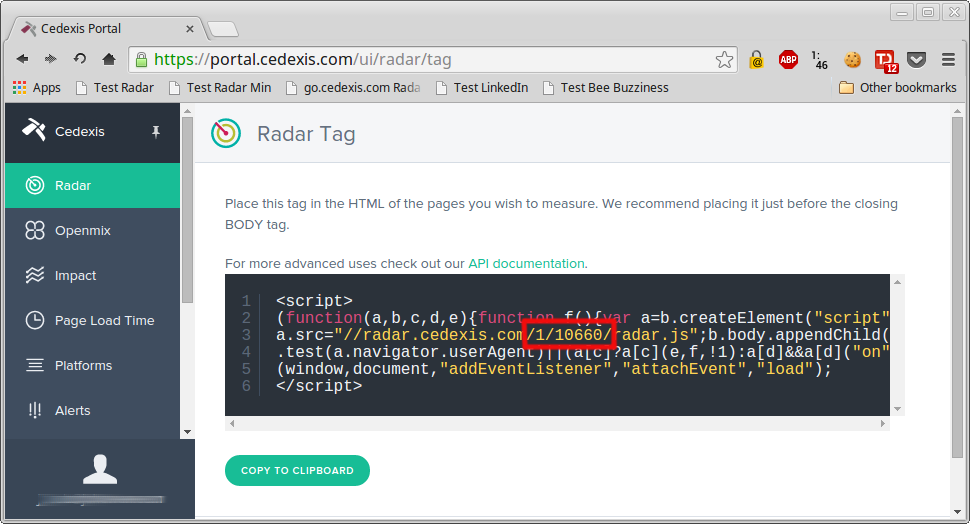

**Table of Contents**

- [AndroidRadar](#androidradar)
    - [Getting Started](#getting-started)
        - [Add the jCenter repository](#add-the-jcenter-repository)
        - [Add dependency on android-radar module](#add-dependency-on-android-radar-module)
        - [Add permissions to AndroidManifest.xml](#add-permissions-to-androidmanifestxml)
    - [How it works](#how-it-works)
    - [Impact](#impact)
    - [Known Issues](#known-issues)
        - [Possible Error Output when run using StrictMode](#possible-error-output-when-run-using-strictmode)
        
# AndroidRadar

The easiest way to get started is by adding the android-radar Maven repository
to your application's gradle build.

## Getting Started

To get up and running quickly, we'll follow these steps:

1. Add the jCenter repository.
2. Add a dependency on the android-radar library module.
3. Specify Android permissions.
4. Execute Radar sessions programmatically.

### Add the jCenter repository

First, make sure your application build.gradle file specifies the jCenter repository:

```groovy
repositories {
    jcenter()
}
```

Alternatively, you can also specify this in the project build.gradle file like this:

```groovy
allprojects {
    repositories {
        jcenter()
    }
}
```

### Add dependency on android-radar module

In your application grade.build file, add a line to the `dependencies` section
indicating the android-radar library.  The latest version available: [  ](https://bintray.com/jacob/maven/android-radar/_latestVersion)

```groovy
// replace x, y and z with the latest version of the AndroidRadar library.
dependencies {
    ...
    compile 'com.cedexis:android-radar:x.y.z'
}
```

### Add permissions to AndroidManifest.xml

The Radar client requires a couple of permissions in order to get its work done.
These should be added to your application's AndroidManifest.xml file, inside the
root `<manifest>` element and before the `<application>` element:

```xml
<uses-permission android:name="android.permission.INTERNET" />
<uses-permission android:name="android.permission.ACCESS_NETWORK_STATE"/>
```

See the sample application's [AndroidManifest.xml](https://github.com/cedexis/AndroidRadar/blob/master/app/src/main/AndroidManifest.xml) for a complete example.

## How it works

In order to leverage the Cedexis Radar JavaScript client on Android, there
is support to insert a WebView and load a simple HTML page containing the
JavaScript client.

To use this, call:

``` java
Radar radarObject = Cedexis.radar(zoneId, customerId);
```

This object can be initialized in your `Application#onCreate` method and passed
to any activity in which you would like to execute Radar measurements.

The `Radar` object then can be used to send Radar measurements from Activities
in `Activity#onCreate`:

``` java
Radar radarObject = getRadarObject();
radarObject.init(YourActivity.this);
```

Each time you would like to send Radar measurements (normally from within
`Activity#onResume` method), call:

``` java
radarObject.start();
```

This loads a hidden WebView in your Activity content and executes a single Radar
session, which usually lasts no more than a couple of seconds.

If you call `radarObject.start` from `Activity#onResume`, the client will execute
a Radar session each time the user returns to that activity.

That's it.  Now every time the user navigates or returns to that activity, a
Radar session will fire.

Note that to start a Radar object requires at least two integer
arguments, namely your Cedexis zone and customer ids.  You may already know
these from correspondence with our team.  In a pinch, these can be obtained
when logged into the Cedexis Portal at https://portal.cedexis.com/ui/radar/tag.
This page shows the JavaScript Radar tag with your zone and customer ids
embedded.



The two numbers in the URL (enclosed by the red box in the screenshot above) are
your zone id and customer id, respectively.

## Impact

Impact is not currently supported from the Radar Android SDK. Support will be included in future releases and documentation for using Impact will be added when it is available from the SDK.
 
## Known Issues

### Possible Error Output when run using StrictMode

This only applies if you are using [StrictMode](https://developer.android.com/reference/android/os/StrictMode.html) in your development builds

As we are injecting an invisible WebView on the main UI thread, it is possible
that you see an error like the following one:

``` java
StrictMode policy violation; ~duration=252 ms: android.os.StrictMode$StrictModeDiskReadViolation: policy=65543 violation=2
    at android.os.StrictMode$AndroidBlockGuardPolicy.onReadFromDisk(StrictMode.java:1263)
    at libcore.io.BlockGuardOs.read(BlockGuardOs.java:229)
    at libcore.io.IoBridge.read(IoBridge.java:468)
    at java.io.RandomAccessFile.read(RandomAccessFile.java:289)
    at java.io.RandomAccessFile.readFully(RandomAccessFile.java:416)
    at java.io.RandomAccessFile.readInt(RandomAccessFile.java:438)
    at java.util.zip.Zip64.parseZip64EocdRecordLocator(Zip64.java:99)
    at java.util.zip.ZipFile.readCentralDir(ZipFile.java:419)
    at java.util.zip.ZipFile.<init>(ZipFile.java:175)
    at java.util.zip.ZipFile.<init>(ZipFile.java:142)
    at android.webkit.WebViewFactory.getLoadFromApkPath(WebViewFactory.java:357)
    at android.webkit.WebViewFactory.getWebViewNativeLibraryPaths(WebViewFactory.java:407)
    at android.webkit.WebViewFactory.loadNativeLibrary(WebViewFactory.java:511)
    at android.webkit.WebViewFactory.getProviderClass(WebViewFactory.java:188)
    at android.webkit.WebViewFactory.getProvider(WebViewFactory.java:158)
    at android.webkit.WebView.getFactory(WebView.java:2277)
    at android.webkit.WebView.ensureProviderCreated(WebView.java:2272)
    at android.webkit.WebView.setOverScrollMode(WebView.java:2331)
    at android.view.View.<init>(View.java:3789)
    at android.view.View.<init>(View.java:3892)
    at android.view.ViewGroup.<init>(ViewGroup.java:573)
    at android.widget.AbsoluteLayout.<init>(AbsoluteLayout.java:55)
    at android.webkit.WebView.<init>(WebView.java:597)
    at android.webkit.WebView.<init>(WebView.java:542)
    at android.webkit.WebView.<init>(WebView.java:525)
    at android.webkit.WebView.<init>(WebView.java:512)
    at android.webkit.WebView.<init>(WebView.java:502)
    at com.cedexis.androidradar.RadarWebView.init(RadarWebView.java:53)
    at com.cedexis.simpleradardemo.MainActivity.onCreate(MainActivity.java:65)
    at android.app.Activity.performCreate(Activity.java:6237)
    at android.app.Instrumentation.callActivityOnCreate(Instrumentation.java:1107)
    at android.app.ActivityThread.performLaunchActivity(ActivityThread.java:2369)
    at android.app.ActivityThread.handleLaunchActivity(ActivityThread.java:2476)
    at android.app.ActivityThread.-wrap11(ActivityThread.java)
    at android.app.ActivityThread$H.handleMessage(ActivityThread.java:1344)
    at android.os.Handler.dispatchMessage(Handler.java:102)
    at android.os.Looper.loop(Looper.java:148)
    at android.app.ActivityThread.main(ActivityThread.java:5417)
    at java.lang.reflect.Method.invoke(Native Method)
    at com.android.internal.os.ZygoteInit$MethodAndArgsCaller.run(ZygoteInit.java:726)
    at com.android.internal.os.ZygoteInit.main(ZygoteInit.java:616)
```

This comes from a bug in the WebView constructor, you can see more information about this over the
AOSP bug tracker: [here] (https://code.google.com/p/android/issues/detail?id=77886&can=1&q=strictmode%20webview&colspec=ID%20Status%20Priority%20Owner%20Summary%20Stars%20Reporter%20Opened)
